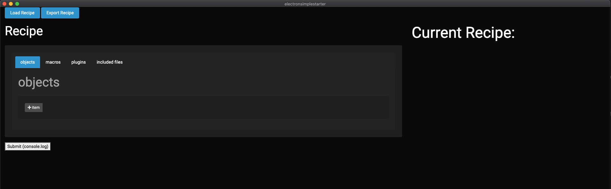
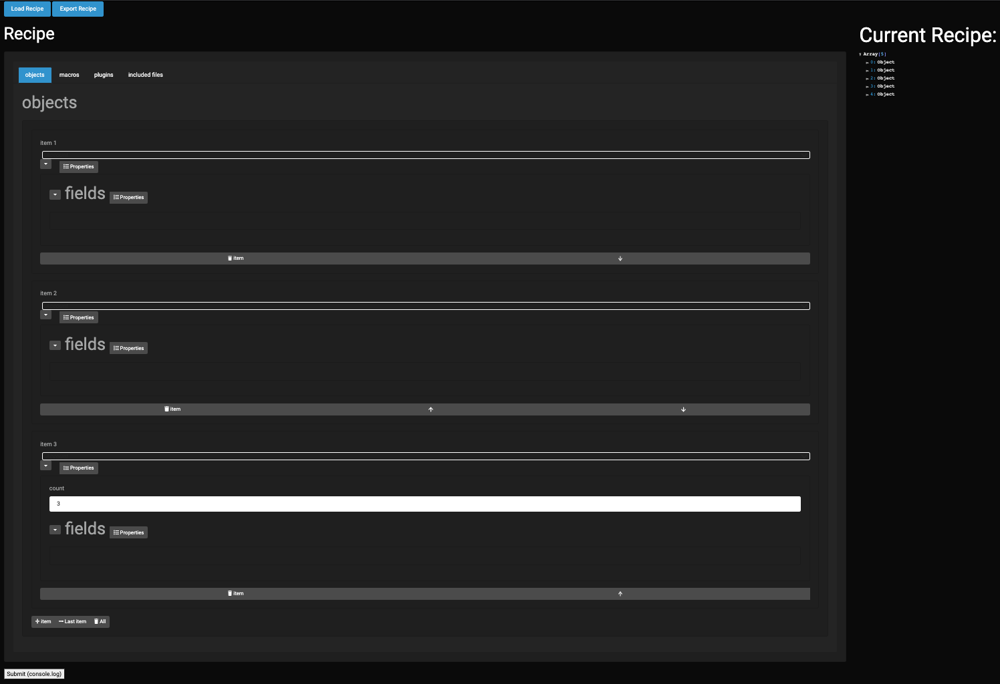

<p align="center">
  <a href="https://raw.githubusercontent.com/acrosman/snowmakery/main/LICENSE"></a>
  <a href="https://GitHub.com/acrosman/snowmakery/issues/"></a>
  <a href="https://GitHub.com/acrosman/snowmakery/pulls/"></a>
</p>

# Snowmakery - Recipe Editor for Snowfakery

[Snowfakery](https://github.com/SFDO-Tooling/Snowfakery) is a tool for generatoring relational data sets. It was created by the Salesforce.org team as [a partial response to a need for better test data](https://www.attain.com/blog/salesforce-open-source-commons) for Salesforce projects. Snowfakery is great, but creating recipe files is a bit hard when you are first learning.

This project is meant to help bridge that gap, while experts will probably want to handcraft the files [until better tools come around](https://github.com/SFDO-Community-Sprints/DataGenerationToolkit), this will hopefully help people understand the options as they are getting started.

Snowfakery does not require Salesforce at all, it's a totally free-standing data generator capable to produce large amounts of carefully shaped data quickly. Snowmakery a free-standing Electron app that is simple meant to generate files for Snowfakery.

### Installation

Download the source code, dependencies, and run the application with [electron](https://www.electronjs.org/docs).

```bash
git clone https://github.com/acrosman/snowmakery.git
npm i
npm start
```



> There is a simple sample Snowfakery recipe in the sample_data directory.



## Contribute

Currently this project is in the very initial stages of development and is not fully functional – please feel free to contribute if you think it would be useful. It does not currently have an app builder setup (although that may change).

After taking a look at the code and the project, you are welcome to make a new Pull Requests or generate an issue in case of any new ideas, bugs or code contribution that you want and is relevant to the project. View the [contributing.md](./contributing.md) and [CODE_OF_CONDUCT.md](./CODE_OF_CONDUCT.md) for more details.
